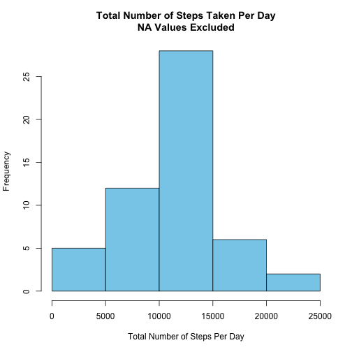
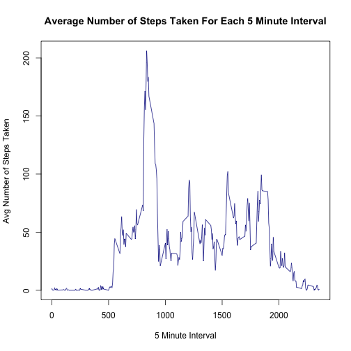
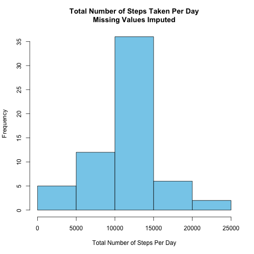
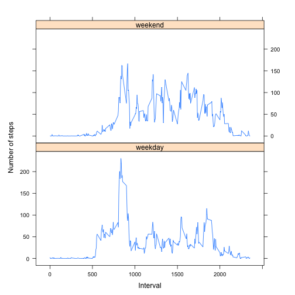

# Reproducible Research: Peer Assessment 1

## Loading and preprocessing the data
We load the data into the activity data frame and convert the date variable into a Date object.
Then we create the activityNoNA data frame, which will have only the complete rows (i.e., no NA values).

```r
activity <- read.csv('activity.csv')
activity$date <- as.Date(activity$date)
activityNoNA <- activity[complete.cases(activity),]
```

## What is mean total number of steps taken per day?

We calculate the total number of steps taken per day:


```r
library('dplyr')
```


```r
stepsPerDay <- activityNoNA %>%
  group_by( date ) %>%
  summarise( totalSteps = sum( steps ) )
```

Here's a histogram of the total number of steps taken per day:


```r
hist( stepsPerDay$totalSteps, 
      xlab='Total Number of Steps Per Day', 
      main='Total Number of Steps Taken Per Day\nNA Values Excluded', 
      col='skyblue' )
```

 

Here is the mean of the total number of steps taken per day:


```r
mean( stepsPerDay$totalSteps )
```

```
## [1] 10766.19
```

Here is the median of the total number of steps taken per day:


```r
median( stepsPerDay$totalSteps )
```

```
## [1] 10765
```

## What is the average daily activity pattern?

We calculate the the average number of steps taken, averaged across all days, by 5 minute interval:


```r
avgStepsPer5MinInterval <- activityNoNA %>%
  group_by( interval ) %>%
  summarise( avgSteps = mean( steps ) )
```

Here is a time series plot (i.e. type = "l") of the 5-minute interval (x-axis) and the average number of steps taken, averaged across all days (y-axis):


```r
with( avgStepsPer5MinInterval,
  plot( interval, avgSteps, 
        type="l", col="darkblue",
        xlab="5 Minute Interval", 
        ylab="Avg Number of Steps Taken", 
        main="Average Number of Steps Taken For Each 5 Minute Interval" ) )
```

 

Here is the 5-minute interval that contains the maximum number of steps (on average across all the days in the dataset):


```r
avgStepsPer5MinInterval[ which.max( avgStepsPer5MinInterval$avgSteps ), 'interval' ]
```

```
## Source: local data frame [1 x 1]
## 
##   interval
## 1      835
```

## Imputing missing values

Here's is the number of rows in the activity data frame containing NA values:


```r
sum( is.na( activity ) )
```

```
## [1] 2304
```

Our strategy for filling in all of the missing values in the dataset is to use the mean for that 5-minute interval. For example, if a row has NA as the 'steps' value and 100 as the 'interval' value, then we replace the NA with the mean number of steps for interval 100 (across all dates).

Next, we create a new dataset that is equal to the original dataset but with the missing data filled in using our strategy:


```r
# Make a copy of the activity data frame.
activityNaFilledIn <- activity+0
# Replace the NA values with the mean number of steps for that interval (across all dates).
for ( i in 1:nrow(activityNaFilledIn) ) {
    if ( is.na( activityNaFilledIn[i, 'steps'] ) ) {
        interval <- activityNaFilledIn[i, 'interval']
        avgStepsForInterval <- avgStepsPer5MinInterval[ avgStepsPer5MinInterval$interval == interval, 'avgSteps' ]
        activityNaFilledIn[i, 'steps'] <- as.integer( round( avgStepsForInterval ) )
    }
}
```

Next, we calculate the total number of steps taken each day using the activityNaFilledIn data frame:


```r
stepsPerDayNaFilledIn <- activityNaFilledIn %>%
  group_by( date ) %>%
  summarise( totalSteps = sum( steps ) )
```

Here is a histogram of the total number of steps taken each day (using the data set where the missing values are imputed):


```r
hist( stepsPerDayNaFilledIn$totalSteps, 
      xlab='Total Number of Steps Per Day', 
      main='Total Number of Steps Taken Per Day\nMissing Values Imputed', 
      col='skyblue' )
```

 

Here is the mean of the total number of steps taken per day (using the data set where the missing values are imputed):


```r
mean( stepsPerDayNaFilledIn$totalSteps )
```

```
## [1] 10765.64
```

Here is the median of the total number of steps taken per day (using the data set where the missing values are imputed):


```r
median( stepsPerDayNaFilledIn$totalSteps )
```

```
## [1] 10762
```

These mean and median values differ slightly from the estimates from the first part of the assignment:
- The new mean (1.0765639 &times; 10<sup>4</sup>) is slightly smaller than the previous mean where the NA values were excluded (1.0766189 &times; 10<sup>4</sup>).
- The new median with imputed values (1.0762 &times; 10<sup>4</sup>) is slightly smaller than the previous median where the NA values were excluded (10765).

## Are there differences in activity patterns between weekdays and weekends?

We'll use the dataset with the filled-in missing values for this part (activityNaFilledIn).

We create a new factor variable (dayType) in the dataset with two levels – “weekday” and “weekend” indicating whether a given date is a weekday or weekend day:
    

```r
activityNaFilledIn$day <- weekdays( activityNaFilledIn$date )
for ( i in 1:nrow(activityNaFilledIn) ) {
    if ( activityNaFilledIn[i, 'day'] %in% c( 'Saturday', 'Sunday' ) ) {
        activityNaFilledIn[i, 'dayType'] <- 'weekend'
    } else {
        activityNaFilledIn[i, 'dayType'] <- 'weekday'      
    }
}
activityNaFilledIn$dayType <- factor( activityNaFilledIn$dayType, levels = c("weekday", "weekend") )
```

Next, we calculate the average number of steps taken, averaged across all weekday days or weekend days, by interval: 


```r
avgStepsPerDayTypeAnd5MinInterval <- activityNaFilledIn %>%
  group_by( dayType, interval ) %>%
  summarise( avgSteps = mean( steps ) )
```

Here is a time series plot (i.e. type = "l") of the 5-minute interval (x-axis) and the average number of steps taken, averaged across all days (y-axis):


```r
library(lattice)
xyplot( avgSteps ~ interval | dayType, 
        data = avgStepsPerDayTypeAnd5MinInterval, 
        aspect = 1/2, 
        xlab = 'Interval',
        ylab = 'Number of steps',
        type = "l" )
```

 

As you can see from the plot, there are differences between weekend days and weekday days. On weekdays, it appears that the person is more active in the morning (compared to weekends).
